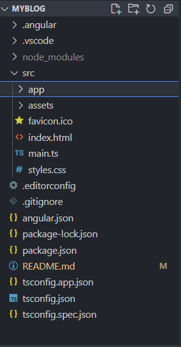

### Hi GitHub and Angular community 👋
- This project was generated with Angular CLI version 16.2.6.
- In this Project you can learn the basic of angular framework in a very easy way.

### ✨ Installation
-----
1. download nodeJs , you can run this commande to make sure your node is download [nodeJs](https://nodejs.org/en).

 ```bash
node --version
```

2. download nvm (Node Version Manager) , you can run this commande to make sure your nvm is download.
 
```bash
nvm --version
```
3. run this commande to make sure your npm is download.
 
```bash
npm --version
```
4. run this commande to install angular CLI which is a tool for managing, building, maintaining, and testing your Angular projects.
 
```bash
npm install –g @angular/cli
```
5. create new angular poject.
 
```bash
ng new project-name
```
6. download your node module in your project in case you don't have it.
 
```bash
npm install
```
7. run your project . Navigate to `http://localhost:4200/`. The application will automatically reload if you change any of the source files..
 
```bash
ng serve
```

### 🔭 How you use nvm
-----
you use nvm when you have old version project or projects with diffrents version of node so you
 need to make sure that you are using the right version

1. use node version (for example here we use version 10).

 ```bash
nvm use 10
```

2. in case you don't have this version you download it .

 ```bash
nvm install 10
```
3. to see all you node version that you have and what you are using now .

 ```bash
nvm list
```
### 🗂 Project Files
-----


## package.json file
- we find the app vesion , name , dependencies , script .....
## node-module file
- never write code in this file because it generated using npm install commande.
## assets file
- for all assets (image , video , css ...).
## index.html
- first file load in the project (if you have diffrent client in your app you can have index.html for each client) .
## envirnement
- the envirnement file does't exist by default but we use it when we need diffrent configuration for example (prod env & test env).
## main.ts
- get all the env info and index file then run the poject.
## style.css
- to create global styles for all the poject.
## app file
- in app file you found the components by default app.component.
- app.component :

  1. app.component.css (style).
  2. app.component.html (ui).
  3. app.component.ts (logic).
  4. app.component.spec.ts (test unit).

- create new component.  
 ```bash
ng g c user
```

    


